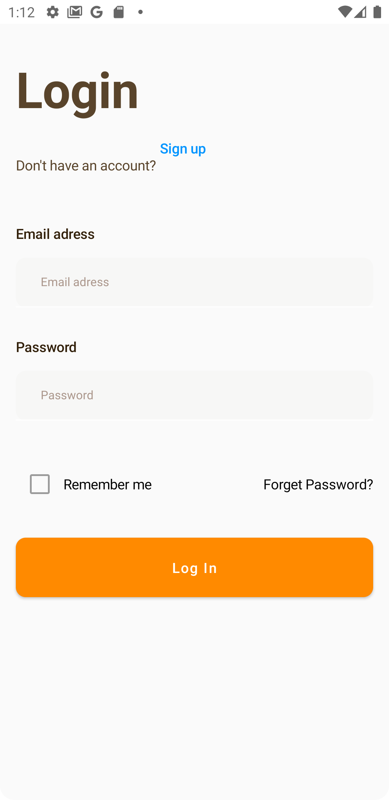
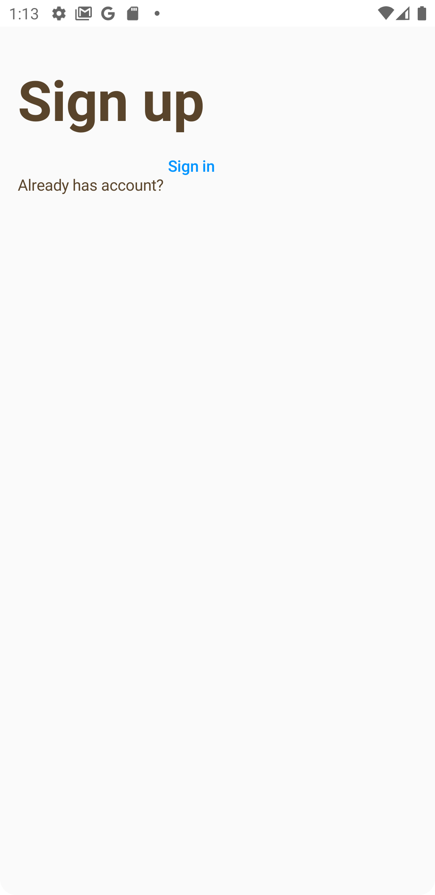

# ItalianCuisineApp
Создание приложения для ресторана итальянской кухни по дизайну из Figma.

## Возможности приложения
* Авторизация пользователей.
* Показ основного меню.
* Резервирование столиков.
* Показ информации о шеф-поварах.
* Отзывы посетителей.
* Показ популярных блюд из меню.
* Информация о ресторане.
* Форма обратной связи.
* Показ местоположения ресторана на карте.
* Возможность раннего бронирования.

## Технологический стек
* MVI
* Kotlin Coroutines
* Room
* Retrofit
* Dagger2
* Jetpack Compose
* Google Maps SDK

## Минимальные требования
* Поддержка Android 5.0+
* Поддержка смартфонов
* Поддержка портретной ориентации
* Приложение должно быть реализовано с рекомендациями Material Design
* targetSdk=30 или выше
* Kotlin

## Приложение находится в разработке, на данный момент реализовано
* Отрисованы экраны авторизации.
* Создана регистрация и аутентификация.

## Скриншоты
 

